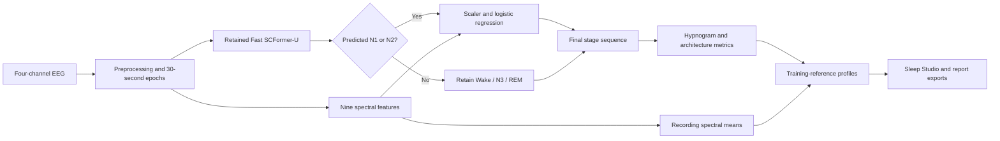
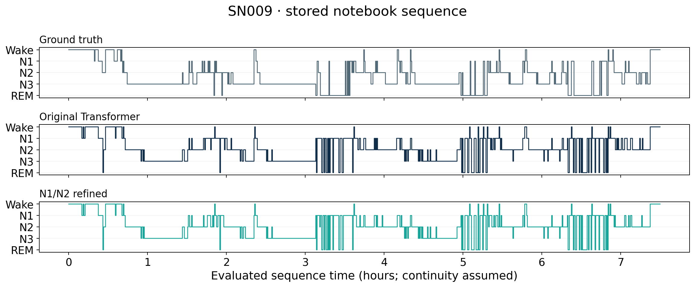

# EEG Sleep Classification and Reference-Based Sleep-Health Profiling

Automated EEG sleep staging using a retained Fast SCFormer-U classifier, targeted N1/N2 spectral refinement, and recording-level reference profiles. The Windows Sleep Studio application displays hypnograms, evaluation results, uncertainty, descriptive profiles, and exported reports.

**Main implementation:** [Biomarker_N1_N2_Refinement.ipynb](Biomarker_N1_N2_Refinement.ipynb). **Verified experiment:** HMC-N1N2-20261007.

**Use for the mid-viva:** [Final blue 15-slide PowerPoint, mentor first](mid_viva_artifacts/output/EEG_Sleep_Mid_Viva_Blue_15_Slides_Mentor_First_Final.pptx) · [PDF](mid_viva_artifacts/output/EEG_Sleep_Mid_Viva_Blue_15_Slides_Mentor_First_Final.pdf).

## Team

| Role | Name | Student ID |
| --- | --- | --- |
| Project mentor | Dr. Santosh Sathpathy | — |
| Team member | Om Ahuja | 23BIT014 |
| Team member | Rikin Parekh | 23BIT044 |

Information and Communication Technology, Pandit Deendayal Energy University.

## Motivation and objectives

Sleep duration alone does not describe interruptions or the distribution of sleep stages. Stage sequences allow sleep onset, Wake after sleep onset, stage proportions, and transitions to be measured. These descriptions can support research and sleep-study review. This project explores automated EEG scoring and interpretable recording profiles; it has not measured clinician time savings or demonstrated diagnostic utility.

The retained classifier has a measurable weakness: 506 true N2 test epochs are predicted as N1. Complementary spectral features offer a targeted way to improve this distinction. Better N1/N2 discrimination improves estimated stage composition; relabeling between those two sleep stages does not itself change total sleep time.

The implemented objectives are five-class epoch classification, training-only spectral refinement, descriptive architecture and spectral measurements, training-reference comparisons, and an interface for reviewing and exporting results.

## Sleep stages and cycles

| Class | Meaning | Why the project measures it |
| --- | --- | --- |
| Wake | Awake before or between sleep periods | Sleep onset and interruptions |
| N1 | Transition into light non-REM sleep | Light-sleep composition and the N1/N2 refinement target |
| N2 | Light non-REM sleep | N2 duration and distinction from N1 |
| N3 | Deep, slow-wave non-REM sleep | Deep-sleep duration and proportion |
| REM | Sleep with active brain activity and rapid eye movements | REM timing and proportion |

A cycle combines NREM and REM phases. The system classifies 30-second epochs and displays their sequence; it does not independently validate or count complete physiological cycles. General descriptions follow [NIH/NHLBI sleep education](https://www.nhlbi.nih.gov/health/sleep/stages-of-sleep).

## Implemented architecture



### Preprocessing and retained model

Input channels are **F4-M1, C4-M1, O2-M1, and C3-M2**. Preprocessing applies a 50 Hz notch at the original sampling rate, 0.3–35 Hz filtering, resampling to 100 Hz, and epoch/channel normalization. Each 30-second epoch has 3,000 samples per channel: **4 × 3,000** input values. Notebook inference normalizes each stored epoch again; exact reproduction retains that step.

Fast SCFormer-U contains Conv1D layers with 64/128 filters, four-head self-attention, a BiLSTM with 64 units per direction, pooling, and five evidence outputs. It has **226,309 parameters**. Attention and the BiLSTM operate within each EEG epoch. The saved history covers 10 training epochs; checkpoint epoch 9 was selected, with Adam learning rate 0.0001 and batch size 128. The current experiment loads the checkpoint rather than retraining it.

### N1/N2 spectral refinement

Welch estimation uses 4-second windows and 2-second overlap at 100 Hz. Channel powers are averaged before ratios are formed. Features are five relative powers—Delta 0.5–4, Theta 4–8, Alpha 8–12, Sigma 12–16, Beta 16–30 Hz—and four band/Delta ratios. Total power spans 0.5–30 Hz; masks exclude each upper band boundary.

A StandardScaler and balanced logistic regression are fitted only on training epochs whose **true and predicted** labels are N1/N2: 1,278 N1 and 4,588 N2 epochs, **5,866 total**. Test routing uses **predicted labels only**. Ground truth supports evaluation, not inference routing. Predicted Wake/N3/REM labels remain unchanged. A different checkpoint requires a compatible refiner.

## Dataset and split

[HMC Sleep Staging Database v1.1](https://physionet.org/content/hmc-sleep-staging/1.1/) documents 151 clinical PSG recordings, four EEG derivations, and original 256 Hz sampling. The project uses a 24-recording subset.

| Partition | Recordings | Stored epochs |
| --- | ---: | ---: |
| Training | 16 | 15,216 |
| Validation | 4 | 3,619 |
| Test | 4 | 3,109 |
| Total | 24 | 21,944 |

Test recordings are **SN001, SN004, SN009, and SN022**. Recording IDs are disjoint across partitions, preventing within-recording epoch leakage. No repeated-night person mapping is supplied, so these IDs alone do not independently establish person-level independence.

SN001 contains only 190 stored epochs (**95 minutes**); its profile describes that segment. NPZ timing assumes contiguous epochs. Whole-night coverage and lights-out timing are not independently established.

## Verified results

Both methods are evaluated on the **same 3,109 test epochs**, independently reproduced as HMC-N1N2-20261007.

| Metric | Retained classifier | N1/N2 refined | Gain |
| --- | ---: | ---: | ---: |
| Accuracy | 55.45% | 59.34% | +3.89 percentage points |
| Macro F1 | 57.42% | 59.51% | +2.10 percentage points |
| N1 F1 | 36.60% | 40.63% | +4.03 percentage points |
| N2 F1 | 57.12% | 63.57% | +6.45 percentage points |

Gains use unrounded values. Of 238 changed predictions, 154 become correct, 33 become incorrect, and 51 remain incorrect. The other 2,871 predictions remain unchanged: **121 net additional correct epochs**. N2-to-N1 errors decrease from 506 to 379.

Evidence: [final results](refinement_artifacts/verified/final_results.json), [split summary](refinement_artifacts/verified/split_summary.json), [epoch predictions](refinement_artifacts/verified/test_epoch_predictions.csv), [fitted refiner](refinement_artifacts/verified/refinement_model.json), and [completion audit](refinement_artifacts/refinement_completion_audit.md).



## Architecture measurements and descriptive profiles

The system measures total sleep time, evaluated-window efficiency, sleep onset latency, Wake after sleep onset, REM latency, stage percentages, awakenings, transitions, and project-defined fragmentation. Each epoch contributes 0.5 minutes. Total sleep time excludes Wake; stage percentages use total sleep time. SOL starts at the evaluated sequence origin, WASO includes terminal Wake after onset, and fragmentation counts all stage transitions per total-sleep-time hour.

The master matrix has recording ID plus 22 numeric fields: 13 recording/architecture fields and nine EEG features. Reference comparisons exclude recording duration and cover 21 fields. Mean, sample SD, median, P10, and P90 come from the **16 training recordings only**. Recording spectral means include all epochs, including Wake.

Ten architecture metrics define four domains: **Duration, Continuity, Initiation, and Architecture**. Zero/one/two/three–four deviated domains give Within Reference/Mild/Moderate/High Deviation. EEG comparisons do not add domain flags. Missing required data can make domains or the overall profile unavailable.

HMC is a heterogeneous clinical cohort, not a healthy normative population. These intervals and deviation levels are **descriptive, not validated severity, disease-risk estimates, or diagnoses**. Model uncertainty differs from reference deviation; changing N1/N2 labels does not recalibrate the retained model's uncertainty.

## Run Sleep Studio

Requirements: Windows, **Node.js 22.12.0 or newer**, and npm. Live inference additionally uses Ubuntu WSL, the existing Colab CLI, a connected Colab runtime, and mounted Drive inputs. Offline verified results can be explored without connecting Colab.

From the repository root:

```powershell
cd gui
npm install
npm start
```

Alternatively launch `gui/start.bat`. Detailed instructions are in [gui/README.md](gui/README.md).

1. In **Connection & settings**, connect the runtime, mount Drive, and verify checkpoint/dataset paths. Wait until readiness is confirmed.
2. In **Data & Run**, choose a project NPZ, Drive input, or Windows EDF/NPZ import.
3. Keep refinement enabled for the retained checkpoint. Disable it for raw inference with an incompatible checkpoint.
4. Inspect hypnograms, original probabilities/uncertainty, raw/refined evaluations, and profiles in **Results**.
5. Export PDF, JSON, CSV, or ZIP reports and artifacts.

Imported NPZs require compatible channel order/preprocessing. Missing timestamps require an explicit continuity assumption; unknown timing or gaps make timing-dependent metrics unavailable. Workers run in isolated `/content/eeg_sleep_studio/<run-id>` folders. Credentials and local application state are excluded from Git.

## Reproduce the current experiment

[refinement_artifacts/reproduce.py](refinement_artifacts/reproduce.py) loads the existing checkpoint and NPZs, extracts features, fits the training-only refiner, evaluates labels, and derives training-reference statistics. It does not train the retained classifier or modify original inputs.

Use Colab with Drive mounted and TensorFlow/Keras, NumPy, pandas, SciPy, and scikit-learn available. Expected paths:

```text
/content/drive/MyDrive/Sleep_Health_Profiling/
├── processed/HMC_preprocessed/subject_split.json
├── processed/HMC_preprocessed/<recording-id>.npz
└── models/HMC_CHECKPOINTS/best_objective1_model.keras
```

Upload or clone the repository into Colab, then run (adjust checkout location as needed):

```python
%run /content/EEG-Sleep-Classification/refinement_artifacts/reproduce.py
```

Outputs go to `/content/eeg_refinement_audit`, with a recovery bundle in the experiment's Drive folder. The full checkpoint and dataset must be supplied through Drive. Recorded versions are in [evaluation_environment.json](refinement_artifacts/verified/evaluation_environment.json). [prepare_verified.py](refinement_artifacts/prepare_verified.py) checks downloaded outputs against the notebook and desktop implementation.

Use complete matrices in `refinement_artifacts/verified/`; display-extracted tables directly in its parent directory may contain truncation markers.

## Development and validation

From `gui/`, after installing dependencies:

```powershell
npm run build
npm test
npm run test:ui
npm run test:desktop
python -m unittest discover -s tests -p "test_*.py"
```

Current refinement tests cover fitted predictions, architecture calculations, reference boundaries, and missing-data behavior. `test_pipeline.py` covers archived Viterbi evidence. Browser/desktop checks require the relevant runtime. These are available verification commands; documentation and presentation edits do not constitute new model validation.

## Limitations and future plan

Current limits include four test recordings, partial SN001 coverage, N1 F1 of 40.63%, assumed NPZ continuity, and no external clinical validation. There is no explicit spindle detector, dedicated formal SWA metric, spectral edge frequency, disease predictor, healthy normative cohort, or repeated-night personalization.

The proposed multistage architecture uses a coarse Wake/REM/NREM classifier and an NREM expert for N1/N2/N3. Their conditional probabilities would be composed into a normalized five-class output, with optional fusion with the retained baseline. A temporal CNN could add context across consecutive epochs, followed by probability calibration. **These extensions are proposed, not implemented or evaluated.**

Next steps are an EDF alignment/quality audit, out-of-fold expert and temporal training, controlled ablations, a newly locked test cohort, external dataset validation, and potentially aligned EOG/EMG specialists. Evaluate macro/class F1, calibration, latency, and errors in sleep measurements alongside accuracy.

Research context: [DeepSleepNet](https://arxiv.org/abs/1703.04046), [SeqSleepNet](https://arxiv.org/abs/1809.10932), [U-Sleep](https://www.nature.com/articles/s41746-021-00440-5), [RobustSleepNet](https://arxiv.org/abs/2101.02452), and the [SLEEPYLAND preprint](https://arxiv.org/abs/2506.08574). Detailed citations are in presentation notes. Published scores use different cohorts/protocols and are not directly ranked against this subset.

## Repository guide

| Path | Purpose |
| --- | --- |
| `Biomarker_N1_N2_Refinement.ipynb` | Main current implementation |
| `gui/` | Electron/React application, worker, tests, and setup |
| `refinement_artifacts/verified/` | Complete current metrics, predictions, refiner, reference tables, and plots |
| `refinement_artifacts/` | Reproduction, verification, audit, root presentation builders, preserved originals |
| `mid_viva_artifacts/output/` | Mid-viva PowerPoints and corresponding PDFs |
| `mid_viva_artifacts/assets/` | Transparent portraits and provenance |
| `mid_viva_artifacts/build/` | Authoring scripts and local drafts/renders/checks |
| `ppt_artifacts/` | Historical HMC-PPT-20261007-01 experiment evidence |
| `ppt_short_artifacts/` | Historical short-deck builder and source copy |
| `notebooks/archive/` | Earlier training notebook and connection-check backup |
| `tools/colab/` | Connection diagnostics and notebook preparation utilities |
| `docs/` | Proposals, audits, summaries, and extracted slide text |
| Root portrait PNGs and logo JPEG | User-supplied team/mentor photos and PDEU logo |

The historical HMC-PPT-20261007-01 experiment used EDF reconstruction, **3,773 test epochs**, and Soft-Viterbi smoothing. Do not mix it with the current **3,109-epoch** N1/N2 refinement experiment. Historical heuristic risk categories are not clinically validated.

## Presentation catalogue

Use the **mentor-first final blue 15-slide deck** for the mid-viva. The root 41-slide report provides implementation detail. Every actual PowerPoint found recursively in this workspace is listed below, including historical and local intermediate files. Local build copies are excluded from Git, so their paths may not exist in a fresh clone. Office `~$` files are temporary locks, not decks.

<!-- PPT_CATALOGUE -->

| PowerPoint path | Slides | Contents and status |
| --- | ---: | --- |
| `final_sleep_stage_project_presentation.pptx` | 41 | Current detailed report: HMC split, preprocessing, model/uncertainty, spectral refinement, confusion matrices, gains, architecture equations, training references, four-domain profiles, dashboard, limitations and reproducibility. |
| `mid.original_backup.pptx` | 41 | Current detailed report: HMC split, preprocessing, model/uncertainty, spectral refinement, confusion matrices, gains, architecture equations, training references, four-domain profiles, dashboard, limitations and reproducibility. Updated third deck; its untouched original is under originals/. |
| `mid_viva_artifacts/build/.chart-data-bG6oRb/candidate.pptx` | 12 | Mid-viva material: motivation, literature, data/epochs, preprocessing visuals, system diagram, model/training, refinement flowchart, gains, hypnogram/dashboard, proposed expert/temporal models and conclusion. Local initial 12-slide draft. |
| `mid_viva_artifacts/build/.chart-data-Cvzos7/candidate.pptx` | 12 | Mid-viva material: motivation, literature, data/epochs, preprocessing visuals, system diagram, model/training, refinement flowchart, gains, hypnogram/dashboard, proposed expert/temporal models and conclusion. Local initial 12-slide draft. |
| `mid_viva_artifacts/build/.chart-data-MQV3K4/candidate.pptx` | 12 | Mid-viva material: motivation, literature, data/epochs, preprocessing visuals, system diagram, model/training, refinement flowchart, gains, hypnogram/dashboard, proposed expert/temporal models and conclusion. Local initial 12-slide draft. |
| `mid_viva_artifacts/build/blue_revision/candidate-blue15.pptx` | 15 | Mid-viva material: motivation, literature, data/epochs, preprocessing visuals, system diagram, model/training, refinement flowchart, gains, hypnogram/dashboard, proposed expert/temporal models and conclusion. Latest local blue 15-slide candidate including abstract/logo and mentor-first closing portraits. |
| `mid_viva_artifacts/build/candidate.pptx` | 12 | Mid-viva material: motivation, literature, data/epochs, preprocessing visuals, system diagram, model/training, refinement flowchart, gains, hypnogram/dashboard, proposed expert/temporal models and conclusion. Local initial 12-slide draft. |
| `mid_viva_artifacts/build/EEG_Sleep_Mid_Viva_12_Slides.pptx` | 12 | Mid-viva material: motivation, literature, data/epochs, preprocessing visuals, system diagram, model/training, refinement flowchart, gains, hypnogram/dashboard, proposed expert/temporal models and conclusion. Initial local 12-slide export, preceding the reviewed version. |
| `mid_viva_artifacts/build/rationale_revision/candidate-13.pptx` | 13 | Mid-viva material: motivation, literature, data/epochs, preprocessing visuals, system diagram, model/training, refinement flowchart, gains, hypnogram/dashboard, proposed expert/temporal models and conclusion. Local 13-slide rationale/stages candidate. |
| `mid_viva_artifacts/output/EEG_Sleep_Mid_Viva_12_Slides_Reviewed.pptx` | 12 | Mid-viva material: motivation, literature, data/epochs, preprocessing visuals, system diagram, model/training, refinement flowchart, gains, hypnogram/dashboard, proposed expert/temporal models and conclusion. Reviewed light-background delivery. |
| `mid_viva_artifacts/output/EEG_Sleep_Mid_Viva_13_Slides.pptx` | 13 | Mid-viva material: motivation, literature, data/epochs, preprocessing visuals, system diagram, model/training, refinement flowchart, gains, hypnogram/dashboard, proposed expert/temporal models and conclusion. Light-background revision with stronger practical rationale and added stage/cycle explanation. |
| `mid_viva_artifacts/output/EEG_Sleep_Mid_Viva_Blue_15_Slides.pptx` | 15 | Mid-viva material: motivation, literature, data/epochs, preprocessing visuals, system diagram, model/training, refinement flowchart, gains, hypnogram/dashboard, proposed expert/temporal models and conclusion. First blue revision adds PDEU logo, four-part abstract and transparent team portraits. Superseded: chart labels needed contrast correction. |
| `mid_viva_artifacts/output/EEG_Sleep_Mid_Viva_Blue_15_Slides_Final.pptx` | 15 | Mid-viva material: motivation, literature, data/epochs, preprocessing visuals, system diagram, model/training, refinement flowchart, gains, hypnogram/dashboard, proposed expert/temporal models and conclusion. Blue revision with readable charts, logo, abstract and portraits ordered Om, Rikin, mentor. |
| `mid_viva_artifacts/output/EEG_Sleep_Mid_Viva_Blue_15_Slides_Mentor_First.pptx` | 15 | Mid-viva material: motivation, literature, data/epochs, preprocessing visuals, system diagram, model/training, refinement flowchart, gains, hypnogram/dashboard, proposed expert/temporal models and conclusion. Intermediate mentor-first revision. Superseded by the next file, which corrects a text-encoding artifact. |
| `mid_viva_artifacts/output/EEG_Sleep_Mid_Viva_Blue_15_Slides_Mentor_First_Final.pptx` | 15 | Mid-viva material: motivation, literature, data/epochs, preprocessing visuals, system diagram, model/training, refinement flowchart, gains, hypnogram/dashboard, proposed expert/temporal models and conclusion. LATEST MID-VIVA: blue, corrected chart labels, PDEU logo, Background/Method/Results/Future abstract; closing portraits Dr. Santosh, Om, Rikin. |
| `ppt_short_artifacts/source_copy.pptx` | 41 | Historical 3,773-epoch report: Transformer, training, uncertainty/calibration, Soft-Viterbi transitions, raw/smoothed results, heuristic profiles, future work and technical appendices. Superseded by current N1/N2 results. Source copy for archived short-deck generation. |
| `refinement_artifacts/build/final_sleep_stage_project_presentation.pptx` | 41 | Current detailed report: HMC split, preprocessing, model/uncertainty, spectral refinement, confusion matrices, gains, architecture equations, training references, four-domain profiles, dashboard, limitations and reproducibility. Local pre-finalization build copy. |
| `refinement_artifacts/build/mid.original_backup.pptx` | 41 | Current detailed report: HMC split, preprocessing, model/uncertainty, spectral refinement, confusion matrices, gains, architecture equations, training references, four-domain profiles, dashboard, limitations and reproducibility. Local pre-finalization build copy. |
| `refinement_artifacts/build/sleep_stage_project_12_slides.pptx` | 12 | Current compact report: HMC input, model, nine spectral features, training/inference gates, gains, architecture, reference domains, recording profiles, dashboard, pipeline and limitations. Local pre-finalization build copy. |
| `refinement_artifacts/build/validated-final_sleep_stage_project_presentation.pptx` | 41 | Current detailed report: HMC split, preprocessing, model/uncertainty, spectral refinement, confusion matrices, gains, architecture equations, training references, four-domain profiles, dashboard, limitations and reproducibility. Local validated export of root deck. |
| `refinement_artifacts/build/validated-mid.original_backup.pptx` | 41 | Current detailed report: HMC split, preprocessing, model/uncertainty, spectral refinement, confusion matrices, gains, architecture equations, training references, four-domain profiles, dashboard, limitations and reproducibility. Local validated export of root deck. |
| `refinement_artifacts/build/validated-sleep_stage_project_12_slides.pptx` | 12 | Current compact report: HMC input, model, nine spectral features, training/inference gates, gains, architecture, reference domains, recording profiles, dashboard, pipeline and limitations. Local validated export of root deck. |
| `refinement_artifacts/originals/final_sleep_stage_project_presentation.pptx` | 41 | Historical 3,773-epoch report: Transformer, training, uncertainty/calibration, Soft-Viterbi transitions, raw/smoothed results, heuristic profiles, future work and technical appendices. Superseded by current N1/N2 results. Preserved pre-update original. |
| `refinement_artifacts/originals/mid.original_backup.pptx` | 41 | Untouched original progress/template deck: Transformer, uncertainty, Soft-Viterbi, biomarker/risk concepts, planned outputs and evidence placeholders. Not a completed verified report. |
| `refinement_artifacts/originals/sleep_stage_project_12_slides.pptx` | 12 | Historical short deck: introduction, objectives, data/preprocessing, Transformer, raw/Soft-Viterbi results, uncertainty, SN009 sequence, heuristic profiles, future models, conclusion and literature. |
| `sleep_stage_project_12_slides.pptx` | 12 | Current compact report: HMC input, model, nine spectral features, training/inference gates, gains, architecture, reference domains, recording profiles, dashboard, pipeline and limitations. |

Temporary Office locks: `~$final_sleep_stage_project_presentation.pptx` and `~$sleep_stage_project_12_slides.pptx`. These are not decks and are excluded from Git.

### Latest mid-viva slide order

1. Cover and PDEU logo
2. Abstract: Background, Method, Results, Future Work
3. Project purpose and rationale
4. Stages and sleep cycles
5. Literature review
6. Dataset and EEG epochs
7. Preprocessing
8. System block diagram
9. Model and training epochs
10. Refinement flowchart
11. Results and gains
12. Hypnogram and GUI outputs
13. Proposed multistage/multimodel architecture
14. Conclusion and milestones
15. Mentor and team: Dr. Santosh, Om, Rikin

Matching PDFs accompany delivered root and mid-viva decks. Latest tables, charts and diagrams are editable; plots/screenshots are raster evidence. Portrait backgrounds were removed with imagegen; the supplied logo artwork was preserved. See [asset provenance](mid_viva_artifacts/assets/PROVENANCE.md).
