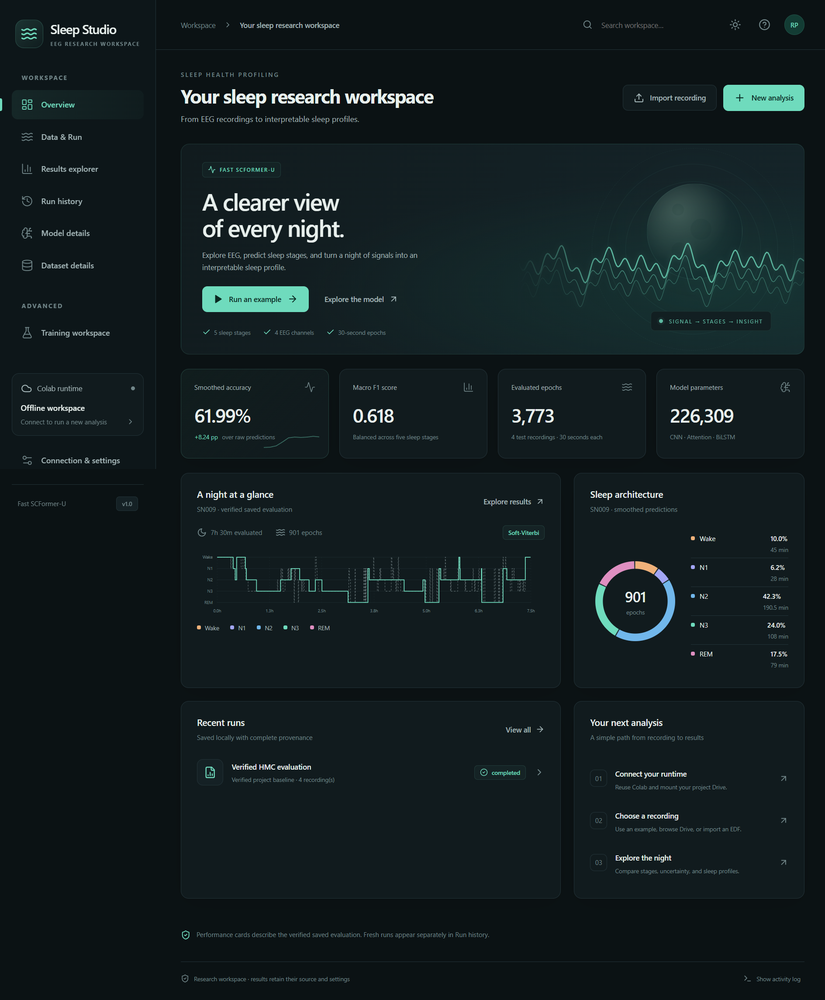

# Sleep Studio

A Windows Electron desktop app for the existing Fast SCFormer-U EEG sleep-stage project. All application source lives in `gui/`. The original notebook, checkpoint, verified evaluation, and presentation artifacts are preserved.



## Start from Windows Terminal

Use a **PowerShell or Command Prompt profile**, with Windows Node.js 22.12+ (LTS recommended):

```powershell
cd "C:\Users\Rikin Parekh\AntiGravity\EEG-Sleep-Classification\gui"
npm install
npm start
```

`start.bat` is the double-click alternative. The launcher builds the frontend before opening Electron. Google sign-in and Drive consent, when required, are handled by app prompts and your Windows browser.

Windows launches Electron natively. Colab operations run through `wsl.exe` in the selected Linux distribution; the default is Ubuntu. In WSL the app discovers the existing CLI at `~/.venvs/colab-cli/bin/colab`, `~/.local/bin/colab`, or on PATH. A custom CLI path is available in settings.

**Switching between Windows and WSL:** dependencies contain platform-specific binaries. The launcher checks the platform and repairs the Electron/esbuild installation when necessary. Prefer Windows for normal use. `npm run dev` opens the development app with Vite; `npm run build` creates the production frontend.

## First analysis

1. Open **Connection & settings**. Choose the WSL distribution and click **Discover sessions** to reuse your current named runtime. Or keep a new session name and click **Connect Colab & Drive**.
2. If Google asks for sign-in, open the authorization link and paste the displayed code into the app. For Drive consent, grant access and click Continue. Existing valid credentials are reused.
3. Check the Drive dataset and checkpoint paths. If packages are missing, click **Install missing packages**. The app checks NumPy, TensorFlow, Keras, MNE, and Matplotlib.
4. Open **Data & Run**, select SN009, and click **Run analysis**. Run History shows progress. Open the completed results to inspect the hypnogram, probabilities, uncertainty, evaluations, profile, and artifacts.
5. Export a PDF, JSON, CSV/image artifact, or the complete result bundle.

## Available workflows

- **Offline browsing:** the verified HMC-PPT-20261007-01 artifacts populate Overview, Results, Model Details and Dataset Details. Opening the app does not allocate a Colab runtime.
- **Project examples:** SN009, SN001, SN004 and SN022 by default, with training/validation recordings accessible through the partition filter. A batch is processed sequentially in one job.
- **Windows imports:** select EDFs and optional matching `_sleepscoring.edf` files, or compatible NPZ files. Imports are uploaded only when starting an analysis.
- **Drive browsing:** navigate mounted MyDrive folders and select EDF/NPZ inputs with optional scoring files.
- **Training:** select explicit, nonoverlapping training/validation/test recording IDs and train the existing architecture into a new experiment. A completed new checkpoint becomes selectable in Data & Run. This does not overwrite the original model or split.
- **Preprocessing:** generate normalized NPZs from selected project EDF/scoring pairs. Output files are contained in the run’s artifacts and ZIP bundle.
- **History and recovery:** each run stores configuration, hashes, outputs and state. A disconnected or interrupted run can be recovered if its remote runtime/files are still present. The app does not restart computations automatically.
- **Cancellation:** sends SIGTERM only after verifying the remote worker identity. Completion/cancellation is acknowledged by the remote worker. Training cancels at batch boundaries; EDF loading/filtering may take time to reach a cancellation check.

## Scientific behavior

Input shape is `(epochs, 4, 3000)` with channels in this order:

1. EEG F4-M1
2. EEG C4-M1
3. EEG O2-M1
4. EEG C3-M2

EDF preprocessing uses a 50 Hz notch, 0.3–35 Hz bandpass, 100 Hz resampling, complete 30-second epochs, and per-epoch/per-channel normalization. The evidential model yields `alpha = evidence + 1`, probabilities `alpha / sum(alpha)`, and uncertainty `5 / sum(alpha)`.

Soft-Viterbi defaults to emission weight 0.9 and training-only transition priors. It resets at recording boundaries and timestamp gaps. NPZ inputs without timestamp provenance require an explicit continuity assumption; otherwise smoothing, WASO, SFI and risk categories are unavailable. Imported NPZs must be confirmed as using the project channel order and preprocessing.

The saved SN001 NPZ has an audited label-alignment problem (190 epochs). Project evaluation reconstructs the complete 854-epoch test input from its original EDF, preserving the original. Training/validation input mismatches stop for inspection.

Accuracy and confusion matrices require aligned ground-truth labels. Profile efficiency and stage percentages use **evaluated-epoch duration**, not verified time in bed. SFI counts coarse stage transitions per scored-sleep hour, excludes gaps, and is not EEG micro-arousal scoring. Categories are research heuristics; probabilities are not separately calibrated. A recording with zero scored sleep is marked Unclassified.

The proposed multistage model is informational future research, not an implemented selectable model.

## Data and credentials

- Windows app data: `%APPDATA%\Sleep Studio\` (Electron userData; exact location follows the app name). Contains settings, run metadata, artifacts, and downloaded ZIPs.
- Linux bridge session state: `~/.local/share/eeg-sleep-studio/sessions.json`, with restrictive permissions. Existing session state from the previous `/tmp/eeg-colab-checks` workflow is imported if available.
- OAuth credentials stay in the CLI’s existing WSL configuration. Tokens and authorization codes are not copied to the repo or reports.
- Remote workers run under `/content/eeg_sleep_studio/<run-id>/`. Colab `/content` is temporary.
- If enabled, completed bundles also go to `MyDrive/Sleep_Health_Profiling/gui_runs/<run-id>/results.zip`.
- Closing the app does not stop a detached remote worker. Use recovery to check its status later. Closing or expiring the Colab runtime can permanently remove temporary files.

## Verification

```bash
npm run build
npm test
python3 -m unittest discover -s tests -p 'test_*.py'
npm run test:ui
npm run test:desktop
```

On Windows, UI tests use installed Chrome when available; otherwise run `npx playwright install chromium` first. See [the recorded validation](docs/validation.md) for completed live checks and their limits.

Python numerical tests use only the standard library and compare every verified epoch’s probability/uncertainty, all four smoothed sequences, aggregate metrics, calibration measures, and all 12 research biomarker profiles. Additional tests cover data gaps, missing continuity, path traversal, report escaping and PTY authorization prompts.

For an explicit live check of an **existing** Colab session (no allocation, training, or notebook execution):

```bash
node scripts/smoke-colab.cjs
node scripts/smoke-colab.cjs --run-example
```

Default test session: `eeg-diagnostics`; override with `SLEEP_TEST_SESSION`. The explicit `--connect` option creates/reuses an isolated CPU test session; mounting Drive still requires Google consent. `node scripts/smoke-worker.cjs` verifies the archived model and actual corrected SN001 input in that isolated session without mounting Drive. The `--run-example` command runs SN009 through the real isolated worker and downloads its results under ignored `gui/.runtime/live-check/`.

For a read-only browser preview of the real project data:

```bash
npm run build
npm run preview
```

Open `http://127.0.0.1:4173`. Colab execution and desktop exports are intentionally available only in Electron.

## Troubleshooting

- **Node is not found:** install Windows Node.js LTS, then open a new Windows Terminal. Do not use the WSL terminal profile for the native Windows app.
- **Wrong WSL distribution:** enter the distribution containing your working CLI and Google credentials, then reconnect.
- **CLI missing:** use its absolute Linux executable path in settings. If WSL is not installed, install it through Windows before connecting; offline result browsing still works.
- **Drive authorization fails:** make sure the browser account matches the CLI account. Multi-account Google consent can require signing into the correct primary account. Reopen consent from the app and retry mounting Drive.
- **Missing runtime packages:** use Install missing packages. Existing packages are left installed; their versions appear in the diagnostics and are saved with inference results.
- **Runtime unavailable:** choose an available accelerator or CPU and reconnect. The app does not silently allocate an expensive alternative.
- **Run interrupted:** recover it from Run History. If `/content` disappeared, rerun from the original input; already downloaded local results remain accessible.
