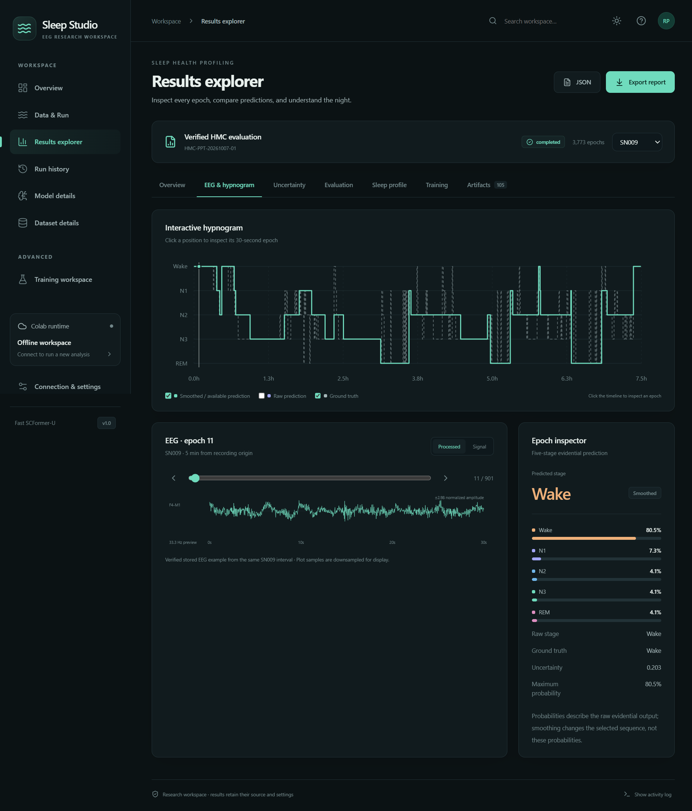

# Validation — 7 October 2026

Validated from this project in Ubuntu WSL and native Windows Node.js 24.14.0.

| Check | Result |
| --- | --- |
| Windows production build | TypeScript and Vite passed |
| Node backend tests | 9 passed |
| Python numerical and bridge tests | 10 passed |
| Windows Chrome UI tests | 3 passed |
| Native Windows Electron | Loaded all 3,773 verified epochs; navigation and EEG charts passed |
| Native Windows → Ubuntu WSL | Distribution discovery and Python JSON bridge passed |
| Native PDF export | Created a valid 1.1 MB PDF with verified metrics and plots |
| Fresh Colab inference | Loaded the actual archived checkpoint; predicted all 854 corrected SN001 epochs; downloaded and unpacked the result bundle |

The live Colab check reproduced SN001 raw accuracy **0.4812646370023419** and Soft-Viterbi accuracy **0.5807962529274004**. It used an isolated CPU runtime and uploaded the actual local checkpoint and corrected NPZ. The original model, inputs and notebooks were preserved. Test downloads and session credentials are excluded from Git.

The numerical suite independently checks every saved epoch’s probabilities and uncertainty, all four smoothed sequences, aggregate metrics, calibration and 12 biomarker profiles. It also covers gaps, unknown continuity, zero sleep, path confinement, report escaping and authorization through a controlling terminal.

## Checks requiring the user's account/data

Google requested fresh Drive consent for the newly allocated test runtime. The live inference test therefore used temporary runtime uploads. The app includes the Drive consent prompt, but a new run reading from this user’s mounted Drive still needs that consent. No full retraining experiment or full EDF preprocessing job was run during these checks.

## Reproduce

In Windows Terminal, from `gui/`:

```powershell
npm run build
npm test
npm run test:ui
npm run test:desktop
```

The browser tests use installed Windows Chrome when available. Otherwise install Playwright Chromium with `npx playwright install chromium`.

In Ubuntu WSL, from `gui/`:

```bash
python3 -m unittest discover -s tests -p 'test_*.py'
```

For the optional live inference check, first create an isolated CPU session using `node scripts/smoke-colab.cjs --connect`, then run `node scripts/smoke-worker.cjs`. This requires authenticated Colab access and the local corrected SN001 input, which is intentionally not committed. See the README for session discovery and Drive authorization.


